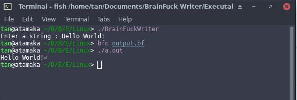

# [BrainFuck Writer](https://en.wikipedia.org/wiki/Brainfuck)
A simple program written in C, that converts a string to its equivalent BrainFuck code.

---
# Working

- Compile the C program with GNU GCC compiler using 
 `$ gcc BrainFuckWriter.c -o BrainFuckWriter`
- Run the compiled program 
`$ ./BrainFuckWriter`
- Input a string and hit enter
- Compile the output.bf with BrainFuck Compiler
 `$ bfc output.bf` 
- Run the compiled code 
`$ ./a.out`
